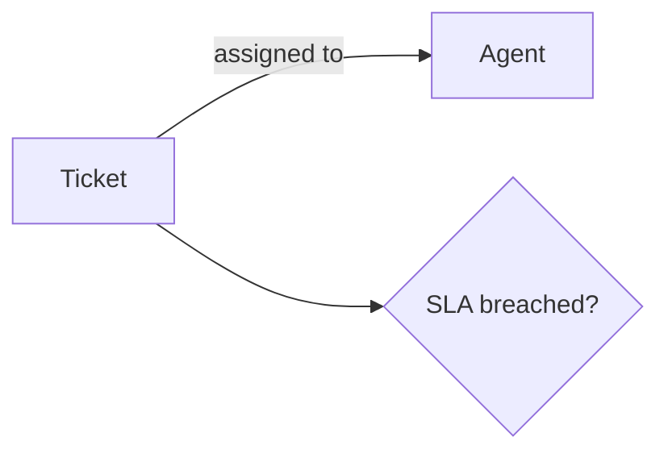

# Authoring GoMental workspace Markdown directly

This is a standalone guide for agents that write directly to a GoMental workspace. A note id maps 1:1 to `<workspace>/<id>.md`: for example, the id `services/billing` is the file `services/billing.md`. Workspace assets live in `assets/<note-id>/`.

Before editing, inspect the relevant workspace area and search its Markdown files for existing coverage. Prefer updating a substantially relevant note over creating a near-duplicate. When concurrent authors may be working in the same workspace, re-read the file immediately before writing and merge their changes; never overwrite an unreviewed change.

## Note format

Every note is UTF-8 Markdown with YAML frontmatter. The only required frontmatter field is `type`; `title` falls back to the first H1 and then the note id when absent, but should normally be set.

```markdown
---
type: <one canonical type from this document>
title: <human-readable title>
tags: [<lowercase, kebab-case, topical tags only>]
description: <optional one-line summary>
repo: <optional repository name or URL>
drafted_by: <optional author/agent provenance>
verified_by: <optional human verifier>
verified_at: <optional date last confirmed>
---

# Title

Body in Markdown. See [Retry policy](/adr/0007-retry-policy).
```

### IDs, paths, and links

- An **id** is the workspace-relative path without `.md`; use `/` for folders. The id `adr/0007-postgres` corresponds to `adr/0007-postgres.md`. Keep ids stable because notes link to them.
- Use ordinary Markdown links to connect notes. A direct link is a **hard link**: explicit and authoritative when it resolves to a real id.
- Link targets resolve as filesystem paths relative to the linking note's folder. A bare sibling link works only in the same folder. From `entities/tickets`, `(semantic-data-model)` resolves to `entities/semantic-data-model`, and `(entities/contracts)` resolves to `entities/entities/contracts`.
- Use workspace-root absolute targets for cross-folder links: `(/semantic-data-model)` and `(/entities/contracts)`. `../` works, and a `.md` suffix is optional and ignored, but `/`-absolute paths are the safe default.
- After writing a link, verify that its target file exists and that the target resolves from the source note's folder. A dangling link silently creates no graph hard link.
- **Soft links** are inferred by GoMental, mainly from title mentions; treat them as suggestions, not authoritative relationships. **Metadata links** come from shared `tag:`, `type:`, and `heading:` hub membership.

### Metadata, provenance, and lifecycle

- `type` is authoritative and queryable. It is a lowercase token and forms a `type:` hub; use only one of the canonical types below. Do not introduce a synonym.
- `tags` are topical, lowercase kebab-case labels such as `billing`, `retry`, or `sqlite`. Never encode the note type as a tag.
- Audience is normally a property of the type, not a tag. Add `audience/human` or `audience/agent` only when an individual note departs from its type's default audience.
- Write durable facts, decisions, and warnings that will matter later, not a conversational task transcript. Prefer small, linked notes over catch-all pages.
- For any note specific to one source repository, set `repo:` to that repository's short name or URL and use the same format consistently across the workspace. Omit it for conceptual, product-level, and cross-repository content.
- Set `drafted_by` when authoring or substantially revising a note. Only a human should set `verified_by` or `verified_at`; do not self-verify.
- Cite note ids when reporting facts learned from the workspace so readers can open the source. Do not cite obsolete notes as current fact.
- When content is stale but worth retaining for history or links, do not silently leave it current or delete it. Add `obsolete: true`, optionally `superseded_by: /replacement-id`, and, when useful, `obsolete_reason: <reason>`. A string `obsolete: "replaced by the v2 billing model"` is also valid. Link the old note forward. If it becomes current again, clear the obsolete flag. `plan` and `progress` have their own retirement rules instead.

## Visuals

Use a fenced `mermaid` block for diagrams whenever possible. Mermaid is editable, searchable, versionable text and is preferable for architecture, flow, sequence, state, and ER diagrams.

````markdown

````

Keep Mermaid labels short. An `erDiagram` fits naturally in an `entity` note; a `sequenceDiagram` often fits a `how-to` or `service` note.

Use PNG, JPEG, GIF, WebP, or SVG only for screenshots, photos, or externally produced visuals. Store each asset under `assets/<note-id>/` and reference it with a normal image path relative to the note's folder:

```markdown

```

Write meaningful alt text: it is both the accessibility label and the searchable/graph-visible description of the image. Keep individual uploaded assets at or below 25 MB.

## Choosing and shaping a type

Select the closest type below. Do not fabricate recommended values: omit unknown metadata. Use the type's home folder for navigation, while treating frontmatter `type` as authoritative if location and type ever disagree. Start the body with an H1 matching `title`, then use the listed H2 sections as a useful skeleton; omit sections that genuinely do not apply.

| Audience | Types | Purpose |
|---|---|---|
| Human-facing | `general`, `term`, `concept`, `adr`, `service`, `entity`, `how-to`, `meeting` | Durable documentation for people, also readable by agents |
| Agent-first, durable | `gotcha`, `convention` | Knowledge agents should consult before acting |
| Agent workspace, transient | `plan`, `progress` | Cross-session and human-visible execution state |

The built-in types are `general`, `term`, `how-to`, and `meeting`. They are supplied by GoMental for every workspace; use them as described here rather than defining replacement synonyms.

### `general` — built-in, home: root or a topic folder

Use for a note that does not fit another type. The built-in template has no required sections beyond its title.

```markdown
---
type: general
title: <title>
---
# <title>
## Notes
```

### `term` — built-in, home: root or `terms/`

Use for a term, definition, or mental model. The built-in template has no required sections beyond its title.

```markdown
---
type: term
title: <term>
---
# <term>
## Notes
```

### `concept` — home: root or `concepts/`

Default for an evergreen explanation of an idea, component, or how something works. Recommended: `description`, `tags`, `verified_at`.

```markdown
---
type: concept
title: <title>
tags: [<topical>]
---
# <title>
> One-line definition.
## Details
## Related
```

### `adr` — home: `adr/`

Architecture or technical decision record. It is immutable in spirit: supersede rather than rewrite. Recommended: `status` (`proposed`, `accepted`, `superseded`, or `deprecated`), `date`, `supersedes`, `superseded_by`, `deciders`.

```markdown
---
type: adr
title: <title>
status: accepted
date: 2026-07-18
superseded_by:
---
# <title>
## Context
## Decision
## Consequences
## Alternatives considered
```

### `service` — home: `services/`

Profile a system or microservice. Recommended: `owner`, `repo`, `tier`, `depends_on`, `tags`.

```markdown
---
type: service
title: <title>
owner: <team / on-call>
repo: <url or id>
depends_on: [<service ids>]
---
# <title>
> What it does, one line.
## Ownership
## Interfaces
## Dependencies
## Related
```

Document APIs, events, and topics in Interfaces; link entities, dashboards, and ADRs in Related.

### `entity` — home: `entities/`

Describe a data entity or domain object, its typed fields, and its consumers. Recommended: `description`, `tags`.

```markdown
---
type: entity
title: <EntityName>
description: <what it represents>
---
# <EntityName>
> What this entity represents.
## Fields
| field | type | description |
|-------|------|-------------|
| id | uuid | Primary key |
## Used by
## Related entities
```

Use body links for consumers and related entities.

### `how-to` — built-in, home: `how-to/`

Instructions for a defined task, broader than a runbook and without mandatory rollback or verification ceremony. Recommended: `audience`, `tags`, `verified_at`.

```markdown
---
type: how-to
title: How to <task>
audience: <who this is for>
---
# How to <task>
**Goal:** what you will achieve.
## Prerequisites
## Steps
1. ...
## Related
```

### `meeting` — built-in, home: `meetings/`

A meeting summary focused on reusable context, decisions, and action items, not a raw transcript. Recommended: `date`, `attendees`.

```markdown
---
type: meeting
title: <title>
date: <yyyy-mm-dd>
attendees: [<person>]
---
# Meeting Summary: <title>
## Snapshot
- Date:
- Time:
- Attendees:
- Related project:
- Source:
## Summary
Short 3-6 sentence narrative of what happened and why it matters.
## Key Points
- 
## Decisions
- Decision:
  Owner:
  Rationale:
  Impact:
## Action Items
- [ ] Task
  Owner:
  Due:
  Context:
## Open Questions
- 
## Follow-Ups
- Next meeting:
- People to notify:
- Notes to link:
## Context / Background
Useful links, agenda items, prior notes, customer context, project state.
## Raw Import
Optional collapsed transcript, agenda, or imported material.
```

### `gotcha` — home: `gotcha/`

A concise trap or warning that agents should read before touching an area. State the warning in `title`. Recommended: `applies_to` (note ids), `tags`.

```markdown
---
type: gotcha
title: <the trap, stated as a warning>
applies_to: [<service/entity/area ids>]
---
# <title>
## What goes wrong
## Why
## What to do instead
```

### `convention` — home: `convention/`

An established way of working, such as error handling, feature flags, or messaging. Recommended: `applies_to` (note ids), `tags`.

```markdown
---
type: convention
title: <the convention>
applies_to: [<area/service ids>]
---
# <title>
## The convention
## Rationale
## Example
## Exceptions
```

### `plan` — home: `plan/`

Planning artifact: approach and intended steps. It persists to resume work across sessions, but should be version-stable once approved; record execution churn in its paired `progress` note. Recommended: `status` (`draft`, `approved`, `in-progress`, `done`, or `abandoned`), `implements` (ADR ids).

```markdown
---
type: plan
title: <what we're building>
status: approved
implements: [<adr ids>]
---
# <title>
## Context / Goal
## Approach
## Areas affected
## Risks
## Verification
```

Include relevant services, entities, and files under Areas affected.

### `progress` — home: `progress/`

Live, cross-session, human-visible state for one effort and its `plan`. It is deliberately not an in-session task list. When the effort ends, distill its outcome into the plan and retire the progress note rather than marking it obsolete. Recommended: `plan` (plan id), `status` (`active` or `complete`), `updated`.

```markdown
---
type: progress
title: <effort name> — progress
plan: <plan note id>
status: active
updated: 2026-07-18
---
# <title>
## Done
## In progress
## Pending
## Deferred / Blocked
```

## Pre-write checklist

1. Search the workspace for an existing note and related ids; update rather than duplicate.
2. Choose a canonical type and its home-folder id.
3. Set `type` and `title`; add known recommended metadata, topical tags, `repo` when repository-specific, and `drafted_by`.
4. Use the type's core body sections and connect related notes with verified `/`-absolute links.
5. Use Mermaid for diagrams; put image files under `assets/<note-id>/` and write real alt text.
6. Re-read the destination before writing if concurrent edits are possible. After writing, verify every linked target resolves and report the authored note id(s).
